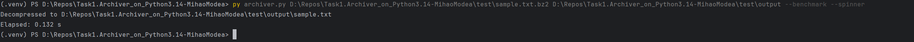
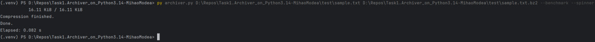
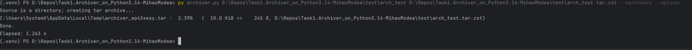
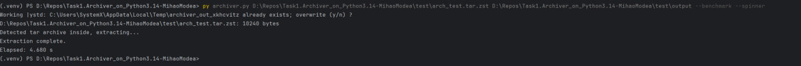

- Использует только стандартную библиотеку Python (в коде).
- Поддерживает формат `.bz2` (модуль `bz2`, встроенный в Python).
- Поддерживает формат `.zst` через внешнюю утилиту `zstd` (в стандартной библиотеке нет реализации zstd, поэтому для `.zst` требуется внешний CLI).
- Если источником является директория, она предварительно упаковывается в tar-архив перед сжатием.
- Режим работы (сжатие/распаковка) выбирается автоматически:
  - если `target` заканчивается на `.bz2` или `.zst`, скрипт выполняет сжатие `source` в указанный архив;
  - если `source` заканчивается на `.bz2` или `.zst`, скрипт распаковывает его в `target` (который может быть директорией).
- Ключ `--benchmark` выводит затраченное время.
- Ключ `--spinner` включает простую анимацию-спиннер в консоли.

## Примеры использования

Сжать одиночный файл в bz2:

```powershell
py archiver.py C:\path\to\file.txt C:\path\to\file.txt.bz2 --benchmark --spinner
```

Сжать директорию в zst (требуется `zstd` CLI):

```powershell
py archiver.py C:\myfolder C:\archives\myfolder.tar.zst --benchmark --spinner
```

Распаковать bz2 (вывод в директорию):

```powershell
py archiver.py C:\archives\file.tar.bz2 C:\output_folder --benchmark --spinner
```

Распаковать zst:

```powershell
py archiver.py C:\archives\myfolder.tar.zst C:\output_folder --benchmark --spinner
```

## Скриншоты

Ниже — примеры вывода утилиты. Файлы находятся в папке `screenshots/`.

1) Сжатие файла (.bz2)



2) Распаковка файла (.bz2)



3) Сжатие директории (.zst)



4) Распаковка директории (.zst)


